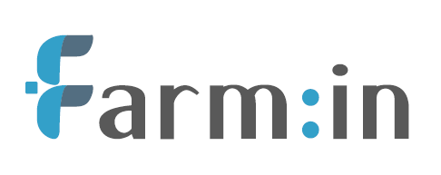

# **안녕하세요 👋, 저는 김관현입니다!**  
**묵묵히 결과로 증명하는 개발자 | 스스로 문제를 해결하는 데 열정을 다하는 개발자**

---

## 🛠️ **저는 이런 개발자입니다**
- 👨‍💻 **묵묵히 결과로 신뢰를 쌓는 개발자**  
  맡은 일을 끝까지 완수하며, 문제를 해결하는 과정에서 성장을 추구합니다.

- 📚 **새로운 기술을 배우고 최적의 해결책을 고민하는 개발자**  
  항상 *"어떻게 하면 더 효과적으로 문제를 해결할 수 있을까?"*를 고민하며, 끊임없이 발전을 도모합니다.

- 🤝 **조용하지만 확실한 협업으로 팀의 성공을 이끄는 개발자**  
  팀워크를 중시하며, 조화로운 협업으로 프로젝트의 성공에 기여합니다.

- 💯 **항상 겸손하고 예의 바른 개발자**  
  작은 의견이라도 경청하고 배우려는 자세를 유지하며, 사람과 기술 모두에서 성장하는 개발자가 되기 위해 노력합니다.

- 🍀 **기록하는 것을 즐기는 개발자**  
  경험과 배움을 체계적으로 정리하며, 기록을 통해 자신의 성장과정을 기록합니다.
    
---
# Careers

 ### (주)푸투라소프트 [↗ 2024.03 ~ 2024.12](http://www.futurasoft.co.kr/) 

**응용 소프트웨어 개발 및 공급업**

### 주요 프로젝트

- 🚀 **한국과학기술정보연구원 및 대전 주변 연구원 홈페이지 유지보수**
  - 웹사이트의 안정적인 운영을 위해 정기적인 점검 및 이슈 해결.
  - 유지보수 작업 수행.

- 🔧 **전자정부프레임워크 마이그레이션 작업 3.10 버전 → 4.20 버전**
  - 기존 시스템을 전자정부프레임워크로 전환하고 호환성 테스트 진행.

- 📊 **ScienceON 관리자 페이지 로그 데이터 일관성 관리**
  - 로그 데이터의 정합성 검사.
  - 로그 데이터의 형식 및 저장 방식 표준화.
  - 관리자 페이지에서 로그 데이터 시각화 및 분석.

- 🛠️ **내부 업무 포탈 재구축 사업**
  - 기존 포탈 시스템 분석 및 요구사항 도출.
  - 전자정부프레임워크 기반의 포탈 기능 재설계.
  - C#에서 Java로 변경.

 ### 삐뽀삐뽀119 [↗ 2025.01 ~ 현재](bippobippo119.com) 

**포트폴리오**

### 프로젝트 

- 📌 서비스 개요
  - 삐뽀삐뽀119는 사용자의 위치 기반으로 가장 가까운 병원을 빠르게 검색하고, 진료과목, 진료시간, 공휴일 진료 여부 등 실시간 병원 정보를 제공하는 병원 통합 서비스 앱입니다. 뿐만 아니라, 대한민국 전역의 병원 데이터와 의료 기술 기반의 다양한 데이터를 수집·분석·시각화하여, 이용자에게 단순한 병원 검색을 넘어 의료 기술 정보까지 소개하는 통합 플랫폼을 목표로 합니다.

- 🎯 서비스 목표
  - 위치 기반 실시간 병원 검색 기능 제공
  - 공공 및 민간 병원 데이터를 통합하여 정확한 정보 전달
  - 진료과, 운영시간, 공휴일 진료 등 상세 필터 제공
  - 국내 병원 및 의료 기술에 대한 시각화된 정보 제공
  - 일반 사용자도 쉽게 이해할 수 있는 헬스케어 데이터 플랫폼 구축
 
---

 ### (주)팜인 [↗ 2025.07 ~ 현재](http://www.farm-in.kr/)

**환경 정화 및 복원업, 전기장비제조업, 전자상거래, 소프트웨어 개발 및 공급업, 자연과학 및 공학연구개발업**

-A8B9CC?style=for-the-badge&logo=c&logoColor=white)

### 프로젝트

- 🚀 회사 모니터링 플랫폼 개발
  
  - 센서 데이터 테이블 통합 및 백엔드 API 설계  
  - 실시간 수집 데이터를 기반으로 한 대시보드 구성  
  - 관리자 페이지를 통해 농장, 센서, 사용자 관리 기능 구현  
  - 로그인 시 유저 정보 저장 및 권한에 따른 메뉴 접근 제어

- 🔧 IoT 센서 펌웨어 개발 (Atmega128)
  
  - Atmega128 마이크로컨트롤러 기반 센서 데이터 수집 펌웨어 개발 (C88/C89 표준)  
  - 타이머/카운터를 활용한 정밀 타이밍 제어 및 센서 샘플링 주기 관리  
  - MQTT 프로토콜을 통한 센서 데이터 실시간 전송 및 원격 제어 구현  
  - UART, SPI, I2C 등 다양한 통신 인터페이스를 활용한 센서 통합  
  - SKT ellink 모뎀을 통한 무선 통신 및 데이터 전송 구현  
  - 128KB 플래시 메모리 제약 하에서 코드 최적화 및 메모리 효율적 설계  
  - SDK 없이 레지스터 레벨 직접 제어를 통한 하드웨어 제어 구현 
---

## 교육

### Queensland University of Technology [↗ 2020.06 ~ 2023.3](https://www.qut.edu.au/)
  - 컴퓨터공학과(전공) & 데이터사이언스(선택)
  - 전체 학점 3.21 / 4.5

##### [2024 GitHub ReadMe](https://github.com/KWANHYUNKIM/-/blob/main/%EC%9D%BC%EB%8C%80%EA%B8%B0/README2024.md)

